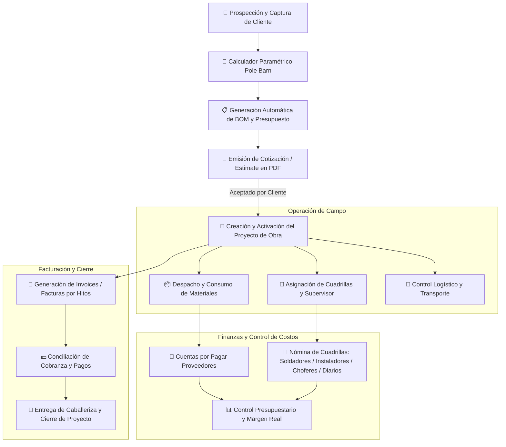
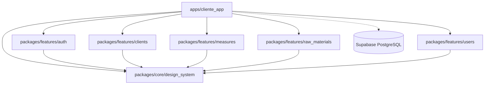

# 🏗️ PoleBarns CRM — Sistema Integral para Construcción de Caballerizas y Estructuras Post-Frame

<p align="center">
  
  
  
  
  
  
  
</p>

---

## 📖 Acerca del Proyecto

**PoleBarns CRM** es una plataforma integral de grado empresarial diseñada específicamente para contratistas y empresas constructoras de **caballerizas, establos ecuestres, naves agrícolas, talleres y galpones bajo el método de construcción Post-Frame (Pole Barns)**.

A diferencia de los CRM genéricos, este sistema fue concebido para resolver la complejidad operativa real del sector de la construcción de estructuras:
- **Cálculos volumétricos y estructurales paramétricos** en tiempo real.
- **Listas de materiales (Bill of Materials - BOM)** y despachos automatizados.
- **Control financiero bidireccional**: presupuestación y facturación a clientes vs. cuentas por pagar y nómina operativa por cuadrillas especializadas (soldadores, instaladores, choferes y jornaleros).

---

## 🚀 Flujo Integral de Negocio (End-to-End Workflow)

El sistema acompaña a la empresa constructora a lo largo de todas las fases del ciclo constructivo y administrativo:



---

## ✨ Módulos y Funcionalidades Principales

### 1. 📐 Estimador y Calculador de Pole Barns (Estructuras y Caballerizas)
* **Parámetros Estructurales**: Configuración flexible de dimensiones:
  * **Largo**, **Ancho** y **Alto**.
  * **Spacing**: Espaciamiento entre postes/columnas.
  * **Sheet**: Calibres y dimensiones de láminas metálicas de techumbre y cerramiento.
* **Cálculo Dinámico de Materiales (BOM)**:
  * Desglose instantáneo de madera tratada, cerchas (*trusses*), montenes, aislantes, láminas y fijaciones.
  * Aplicación configurable de **Factor de Desperdicio (`Waste %`)** por ítem.
* **Inteligencia Financiera de Costeo**:
  * Costo real de compra (`cost`) vs. Precio de venta sugerido (`precio_venta`).
  * Cálculo de Mano de Obra calculada (`labour`).
  * Indicador de límite presupuestario (`budget_limit`) y semáforo de alertas operativas (`alert_status`).
* **Documentación Técnica en PDF**: Generación inmediata de resúmenes de estimación con diseño profesional y desglose para el cliente.

### 2. 👥 Gestión Comercial y Clientes (CRM)
* **Directorio Centralizado**: Ficha de contacto de clientes particulares, haciendas, ranchos y empresas agrícolas.
* **Historial 360°**: Visualización de todas las cotizaciones previas, proyectos ejecutados y facturas vinculadas.
* **Conversión Ágil**: Conversión de presupuestos aprobados a proyectos activos en un solo paso.

### 3. 🏗️ Seguimiento y Control de Obra (Project Tracking)
* **Control de Fases**: Monitoreo en tiempo real del progreso constructivo (*En Planificación*, *En Taller/Soldadura*, *En Montaje/Instalación*, *Finalizado*).
* **Asignación de Personal y Cuadrillas**: Designación de supervisores de obra y asignación de cuadrillas de campo.
* **Control de Consumo de Materiales**: Comparativa entre los materiales presupuestados y los realmente utilizados en obra.
* **Hojas de Despacho en PDF**: Listas de corte y listas de despacho para bodega e instalación.

### 4. 🧾 Facturación e Invoicing
* **Generación de Facturas**: Creación de facturas asociadas a contratos de obra o ventas directas.
* **Seguimiento de Pagos**: Trazabilidad de facturas en borrador, emitidas, pagadas en su totalidad, parciales o vencidas.
* **Generador de Invoices en PDF**: Renderizado e impresión de facturas con membrete, términos de pago y desglose contable.

### 5. 💸 Cuentas por Pagar (Accounts Payable)
* **Gestión de Pasivos y Proveedores**: Registro de facturas de compra de materiales (madera, acero, herrajes, concreto, fletes).
* **Control de Abonos y Saldos**: Registro de abonos parciales y liquidación de facturas.
* **Imputación de Gastos**: Asignación directa de costos a proyectos individuales para determinar la rentabilidad neta real por obra.

### 6. 👷‍♂️ Nómina Especializada en Construcción (Payroll)
Módulo adaptado a la forma de trabajo del sector de la construcción de estructuras:
* **Pagos Diarios (Jornaleros)**: Liquidación ágil para personal de apoyo temporal y horas extras.
* **Soldadores**: Remuneración por estructuras elaboradas, cerchas ensambladas o jornadas técnicas.
* **Cuadrillas de Instalación**: Pagos por avance en terreno (posteo, techado, cerramiento).
* **Choferes y Transporte**: Control de fletes, entrega de materiales pesados y viáticos de viaje.

### 7. 🔐 Seguridad, RBAC y Equipos de Trabajo
* **Control de Acceso Basado en Roles (RBAC)**:
  * **Administrador**: Control total sobre finanzas, nómina, proyectos y configuración global.
  * **Trabajador / Supervisor**: Acceso restringido al seguimiento de tareas y proyectos de obra sin visibilidad de balances confidenciales.
* **Gestión de Cuadrillas**: Agrupación de operarios en cuadrillas organizadas con un líder o capataz responsable.
* **Seguridad Supabase**: Políticas a nivel de fila (**RLS**) que garantizan la privacidad de los datos.

### 8. ⏱️ Automatizaciones e Infraestructura
* **Supabase Heartbeat (GitHub Actions)**: Flujo de trabajo automatizado que envía pings periódicos a la API REST de Supabase para evitar pausas automáticas en planes de uso libre.
* **Multiplataforma y Web Ready**: Optimizado para Flutter Web con distribución lista para **Firebase Hosting**.

---

## 🏛️ Arquitectura del Sistema (Melos Monorepo)

El proyecto utiliza una arquitectura monorepo modularizada mediante **Melos**, separando la aplicación principal de los paquetes del dominio y diseño reutilizables:



### Detalle de Paquetes:

| Directorio | Tipo | Descripción |
| :--- | :--- | :--- |
| **`apps/cliente_app`** | Aplicación Principal | Contiene las pantallas, controladores (Riverpod), rutas (GoRouter) y dashboards principales de PoleBarns CRM. |
| **`packages/core/design_system`** | Núcleo de Diseño | Sistema de diseño consistente: paleta de colores, tipografías, botones, inputs y temas claro/oscuro. |
| **`packages/features/auth`** | Feature Package | Autenticación de usuarios, login, registro y gestión de sesión con Supabase Auth. |
| **`packages/features/clients`** | Feature Package | Modelos, repositorios y UI para la administración del directorio de clientes. |
| **`packages/features/measures`** | Feature Package | Lógica y utilidades para el manejo de medidas y cotas de construcción. |
| **`packages/features/raw_materials`** | Feature Package | Catálogo y gestión de inventario de materias primas (acero, madera, perfiles, etc.). |
| **`packages/features/users`** | Feature Package | Gestión de colaboradores, roles (RBAC) y cuadrillas de trabajo. |

---

## 🛠️ Stack Tecnológico

| Capa | Tecnologías |
| :--- | :--- |
| **Lenguaje** | [Dart 3.x](https://dart.dev/) |
| **Framework UI** | [Flutter 3.x](https://flutter.dev/) (Web / Desktop / Mobile) |
| **Gestor Monorepo** | [Melos](https://melos.invertase.dev/) |
| **Gestión de Estado** | [Riverpod](https://riverpod.dev/) (`flutter_riverpod`) |
| **Enrutamiento** | [GoRouter](https://pub.dev/packages/go_router) |
| **Backend & Base de Datos** | [Supabase](https://supabase.com/) (PostgreSQL, Auth, RLS, Storage) |
| **Generación de Documentos** | [pdf](https://pub.dev/packages/pdf) & [printing](https://pub.dev/packages/printing) |
| **Variables de Entorno** | [flutter_dotenv](https://pub.dev/packages/flutter_dotenv) |
| **Alojamiento y Despliegue** | [Firebase Hosting](https://firebase.google.com/docs/hosting) |
| **CI / Automatización** | GitHub Actions |

---

## 📁 Estructura del Repositorio

```text
PoleBarns/
├── .github/
│   └── workflows/
│       └── heartbeat.yml          # Supabase Keepalive (Ping programado)
├── apps/
│   └── cliente_app/               # Aplicación cliente Flutter
│       ├── .env.example           # Plantilla de variables de entorno
│       ├── web/                   # Configuración de compilación Web
│       └── lib/
│           ├── config/            # Router, temas y proveedores base
│           ├── features/          # Módulos de negocio (Invoices, PoleBarns, Payroll, etc.)
│           ├── screens/           # Pantallas del shell y dashboard
│           └── main.dart          # Entrada principal de la app
├── packages/
│   ├── core/
│   │   └── design_system/         # Tokens de diseño y widgets reutilizables
│   └── features/
│       ├── auth/                  # Inicio de sesión y seguridad
│       ├── clients/               # Módulo de clientes
│       ├── measures/              # Cálculos y conversiones dimensionales
│       ├── raw_materials/         # Catálogo de materiales y costos
│       └── users/                 # Gestión de usuarios y cuadrillas
├── supabase/                      # Scripts y configuraciones de base de datos
├── db_decouple_projects.sql       # Migraciones y actualizaciones de base de datos
├── db_unify_groups.sql
├── db_update_invoices.sql
├── firebase.json                  # Configuración de Firebase Hosting
├── melos.yaml                     # Orquestador del monorepo
└── pubspec.yaml                   # Dependencias raíz del espacio de trabajo
```

---

## 💼 ¿Buscas un Sistema Altamente Personalizado para tu Negocio?

> **Digitaliza tu operación, optimiza tus costos y maximiza tus márgenes con software diseñado exclusivamente para la forma en que tú trabajas.**

**PoleBarns CRM** es un ejemplo real de cómo la tecnología moderna puede transformar por completo la administración operativa de empresas de construcción, contratistas y talleres. 

Si tu empresa se dedica a la **construcción, instalación de estructuras, naves industriales, carpintería metálica o gestión de obras en campo** y necesitas una solución:

- 🎯 **100% Hecha a la Medida:** Adaptada a tus fórmulas de cálculo paramétrico, materiales específicos, cubicación y flujos operativos reales.
- ⚡ **Multiplataforma de Alto Rendimiento:** Accesible desde la web, tabletas y móviles en terreno o computadoras de escritorio en oficina con una experiencia moderna y fluida.
- 📊 **Control Total de Rentabilidad:** Enlace en tiempo real entre cotizaciones (Estimates), compras a proveedores (Cuentas por Pagar), nómina especializada de cuadrillas y facturación formal (Invoices).
- 🔒 **Propiedad y Privacidad de tus Datos:** Infraestructura robusta, moderna y escalable, sin depender de software genérico rígido ni suscripciones mensuales limitantes.
- 📑 **Documentación Profesional Automatizada:** Generación instantánea de presupuestos, órdenes de despacho y facturas en PDF con el branding de tu empresa.

---

### 📩 ¡Contáctame y Construyamos tu Solución!

¿Quieres llevar el control de tus proyectos con un sistema hecho a la medida de tus necesidades? **Hablemos:**

<p align="center">
  <a href="https://github.com/acostheta">
    
  </a>
</p>

> *"El software debe adaptarse a la forma en que construyes tu negocio, no al revés."*

